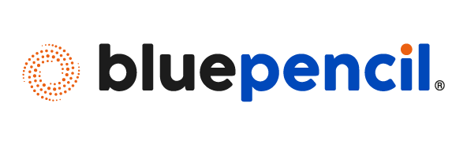
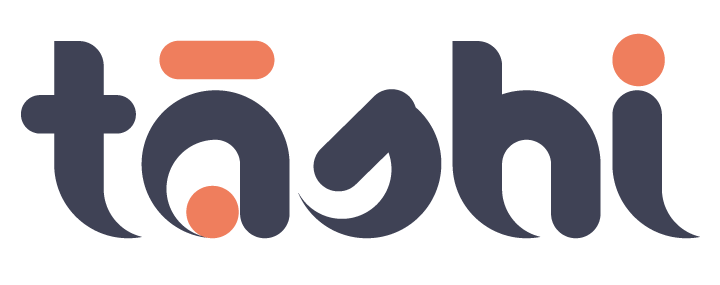

### *Empowering Social Impact Through Technology*

**We are here to make a difference**

---

---

## 💡 Who We Are

We're a **Mumbai-based technology and advisory firm** on a mission to transform the social sector through **AI-powered solutions** and **evidence-based strategies**. Since 2021, we've been building tech that matters—helping NGOs, unions, and social enterprises create measurable impact.

Our advisory team brings together **domain experts who are legends in their fields**, combining deep sector knowledge with cutting-edge technology to reimagine how social programs work.

## 🎯 What We Build

###  **Tāshi Platform** - AI-Powered Program Management Suite
*Visit [tashi.in](https://tashi.in) to see our flagship product*  
**DPDP Compliant**

End-to-end SaaS solution connecting social investors, implementers, and participants with:
- Real-time monitoring, AI-powered audits & instant red flags
- Multi-stakeholder program frameworks aligned to global standards
- Android & web interfaces with smart field controls
- AI-driven entity resolution managing millions of records
- Bespoke dashboards for impact measurement and transparency

### **Mobile Apps for Social Good**

|  **Vayam** |  **Lekha** |
|:---:|:---:|
| Digital efficiency for field operations in social development. Streamlines participant onboarding, location-based assessments, and encrypted data collection with real-time performance tracking. | Dynamic platform for engaging with government schemes, capacity building, and career development. Features multilingual design, business planning, resume building, and QR-based participant tracking. |
|  |  |

### **Proven Impact at Scale**

|  **Hunaar** |  **Garima** |  **Ummeed** |  **Arpan** |
|:---:|:---:|:---:|:---:|
| **200,000+** marginalized youth skilled | **78,000+** women empowered | **320,000+** COVID vaccine doses administered | **78,000+** women authenticated **262,900+** food kits distributed |

**474,000+** total participants impacted across all programs

## 🛠️ How We Build

As an **AWS partner**, we leverage modern technologies and open-source tools to build scalable, cloud-native solutions. Our team uses **AI coding tools** to accelerate development, maintains functional **CI/CD pipelines**, and spins up infrastructure via **IaC** (Infrastructure as Code). We combine engineering excellence with social impact focus.

## 🌱 Why Join Us?

**Make Real Impact** - Your code directly helps millions of people across India  
**Cutting-Edge Tech** - Work with AI/ML, cloud-native architectures, and modern tooling  
**Solve Hard Problems** - Build tech for complex, high-stakes social programs  
**Mission-Driven** - Technology that creates measurable, lasting change  
**Learn from Legends** - Collaborate with domain experts at the top of their fields

## 📬 Let's Connect!

**Interested in joining our team?** We're always looking for passionate engineers who want to use their skills for social good.

- Visit us: [bluepencil.com](https://bluepencil.com)
- Connect: [LinkedIn](https://www.linkedin.com/company/bluepencilstrategies)
- Explore: [tashi.in](https://tashi.in)

---

### *We are here to make a difference*

*Building technology that transforms lives*

